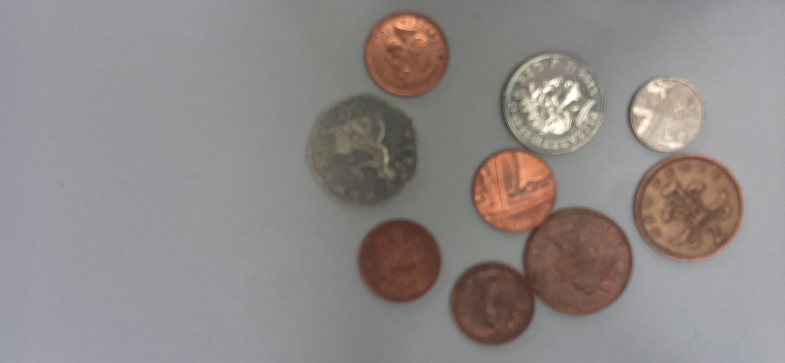
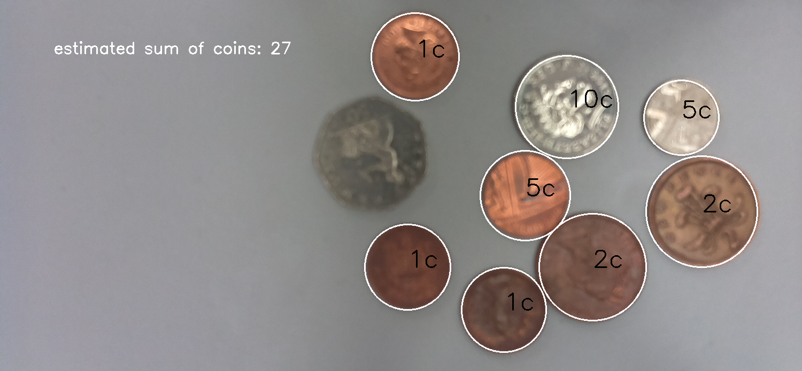

# Coins Detection
This project is a Computer Vision Short Program aims to detect circular coins Using **OpenCV-Python Module** and *Hough Circle Algorithm*.

### Overview
It's a capstone project as part of [Python Programmer Bootcamp - Data Science 365](https://learn.365datascience.com/courses/python-programmer-bootcamp). Its objectif was to apply and solidify python programming concepts such as:
- Function
- Different Data Types
- Loops
- Flow Control
- Circle Detection

With less than **100 lines of code**, the program can:
- Detect coins in an image.
- Classify them based on their radii and brightness.
- Label each coin with its respective value.
- Calculate the total value of all coins.

 

## Example Output.

#### Input

#### Output

 

## Features
1. Coins Detection.
2. Coins Classification (by radii and brightness).
3. Coins Labeling with determined value.
4. Sum Calculation on the image.

 

## Setup and Usage
1. Clone The Repo.
`git clone https://github.com/andrew-remon/coins-detection.git`
3. Install The Required Libraries.
`pip install opencv-python numpy`
4. Run The Script.
`python cap_project.py`

 

## Acknowledgments
- [OpenCV Module - Hough line transform](https://docs.opencv.org/4.x/d6/d10/tutorial_py_houghlines.html)
- [Numpy Library](https://numpy.org)

This Project is based on the concepts and resources provided by [Python Programmer Bootcamp - Data Science 365](https://learn.365datascience.com/courses/python-programmer-bootcamp)
 
Special Thanks to **_Giles McMullen-Klein_** for his superb teaching techniques and insights.

 

## Notes
- This README assumes you have basic knowledge of Python and OpenCV.
- Don't forget to include the photos in the same folder as the project directory.

 

## Contact
I would be glad to hear your opinions, suggestions for improvements, and share knowledge together. Feel free to reach out – I look forward to connecting with you!
 
**Email:** andrewremon2005@outlook.com
 
**GitHub:** https://github.com/andrew-remon
 
**LinkedIn:** www.linkedin.com/in/andrewremon
